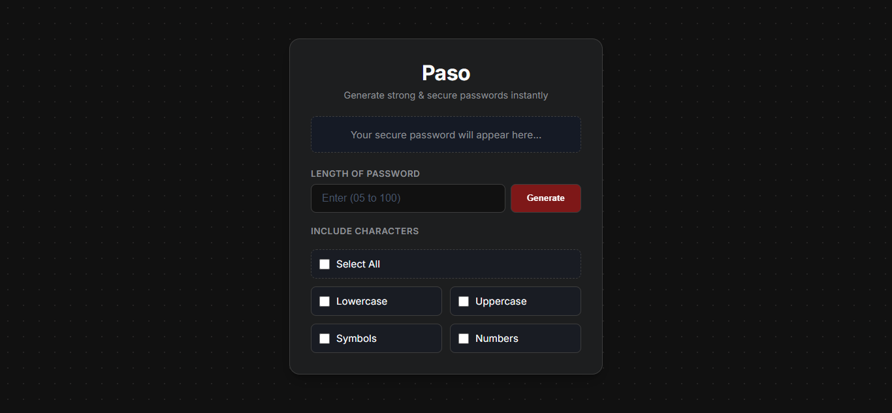

# Paso - Secure Password Generator 

Paso is a modern, responsive, and incredibly sleek browser-based password generator tool. 



## Features

- **Guaranteed Character Rules:** Unlike standard randomizers, Paso implements a secure algorithmic pooling mechanism that guarantees at least *one* character is included from every active criterion you select.
- **Fisher-Yates Shuffle Integration:** Shuffles the generated character positions completely to neutralize predictable clustering patterns.
- **Modern Dark UI:** A gorgeous custom dark interface featuring an elegant dynamic dot-grid background structure.
- **No Mobile Tap-Flash:** Includes strict styling rules that eliminate the annoying native mobile selection overlays, giving it a premium app feel.


## Quick Start / Local Deployment

Since this app is built purely with vanilla frontend languages, it has **zero external package dependencies** and requires absolutely no configuration.

1. **Clone the repository:**
   ```bash
   git clone https://github.com/ayushxpundir/Paso.git
2. **Navigate into the directory:**
    ```bash
    cd Paso
    ```
3. **Launch the app:** Simply double-click index.html to run it right in your web browser, or launch it using the VS Code Live Server extension.

## License
This project is open source and available under the MIT License.
